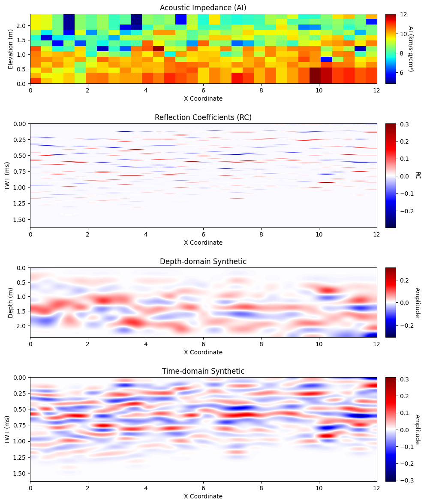
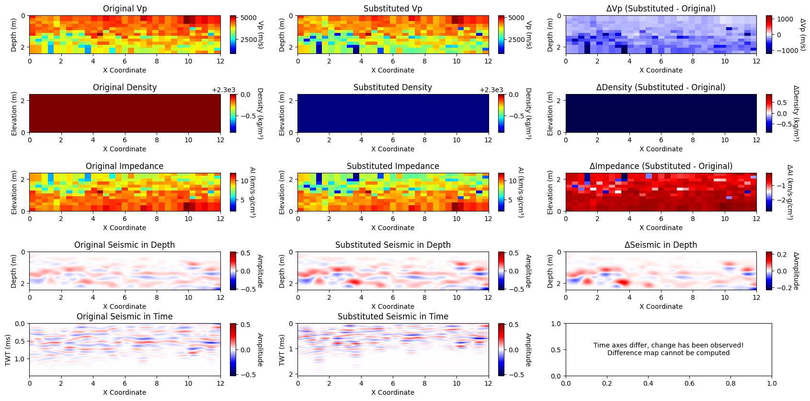

# Advanced Seismic Interpretation: SeismicModeler

**Course**: Advanced Seismic Interpretation  
**Instructor**: Dr. Mathilde Adelinet  

## Overview

This repository contains the Python implementation of a synthetic seismic modeling tool (`SeismicModeler`) developed as part of the Advanced Seismic Interpretation course taught by Dr. Mathilde Adelinet. The model is designed to:

- Generate synthetic seismic sections from velocity (Vp) and density (Rhob) data.
- Perform fluid substitution analysis using the Biot-Gassmann equation.
- Visualize the generated seismic responses in both depth and time domains.

## Dependencies

- Python 3.x
- NumPy
- Pandas
- Matplotlib
- SciPy
- Bruges (for geophysical utilities)

Install required packages using:

```bash
pip install numpy pandas matplotlib scipy bruges
```

## Data Input

The model reads data from an Excel file containing the following sheets:

- `X`: Horizontal coordinates
- `Y`: Depth coordinates
- `VP`: P-wave velocity data
- `RHOB`: Bulk density data

Each sheet should be formatted without headers.

## Usage

Initialize the model:

```python
from seismic_modeler import SeismicModeler

model = SeismicModeler(
    excel_file='path/to/data.xlsx',
    dt_time=0.001,                 # Sampling interval in milliseconds
    wavelet_frequency=6000,        # Frequency of Ricker wavelet in Hz
    lithology='Limestone',         # Lithology type: Sandstone, Limestone, Dolomite
    velocity_in_km_s=False         # Set True if velocity is in km/s
)
```

**Example plot of this modelling workflow is given below. This modelling result represents the output of the given dataset.**


Compute and visualize synthetic seismic:

```python
model.compute_impedance()
model.compute_reflectivity_in_depth()
model.generate_seismic_in_time()
model.convert_time_to_depth()
model.plot_results()
```

Perform fluid substitution using Biot-Gassmann:

```python
model.BiottGassman(
    avg_exp_Phi=0.192,
    avg_exp_Sw=0.15,
    avg_exp_So=0.85,
    avg_exp_oil_rho=700,
    avg_exp_gas_rho=150,
    avg_exp_W_rho=1000,
    avg_exp_final_Sw=0.3,
    avg_exp_final_So=0.3,
    Khc=1.8, Kg=0.041, Kw=2.5,
    update=True,
    plot=True
)
```

**Example plot of this fluid substitution workflow is given below. This example assumes that the oil-water system is partially replaced by gas.**


## Visualization

The visualization includes:

- Acoustic Impedance
- Reflection Coefficients
- Synthetic seismic data in both depth and time domains
- Comparisons between original and fluid-substituted properties

## Fluid Substitution (Biot-Gassmann)

The fluid substitution module computes:

- Dry rock bulk modulus (`Kdry`)
- Bulk modulus of the rock saturated with different fluids (`Ksat`)
- Final mixture density (`rhob_final`)
- Updated velocities (Vp, Vs) after fluid substitution

## Contribution

Contributions, suggestions, and enhancements are welcome. Please create a pull request or raise an issue.

## Acknowledgements

Special thanks to Dr. Mathilde Adelinet for her invaluable guidance throughout this project.

---

© [Berat Tuğberk Günel], [2025]

